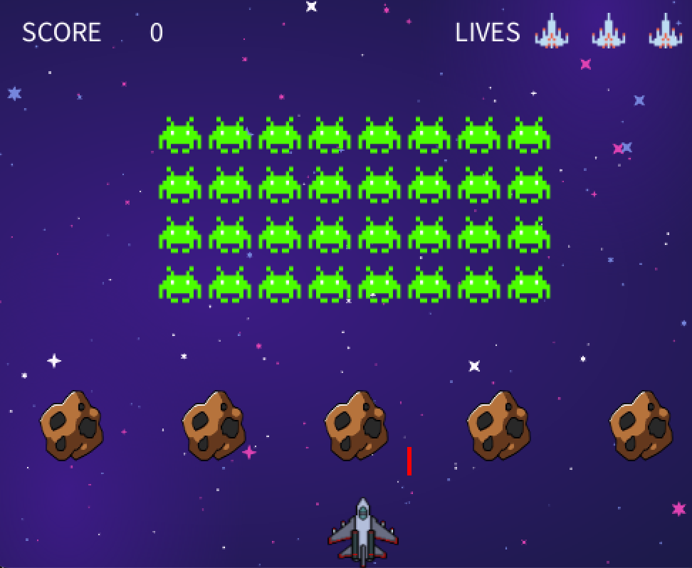

# Top Gun
Welcome to Top Gun! This game is unique because it is Top Gun themed in space! The objective of the game is to eliminate all of the aliens before they reach you (the ship) or before you lose all of your lives. 

The aliens move closer because as they hit their boundaries on the left and right side of the screen they slightly move down each time. If the alien(s) reach you before you eliminate all of them, you lose. You have three lives, which are indicated at the top right of the screen and each time an alien shoots you, you lose a life. If you get hit three times and lose all three lives you also lose. 

You can eliminate the aliens by shooting at them, however they can shoot at you too. The aliens shoot randomly so you have to be careful where you move your ship. You can only move left to right using the ‘a’ and ‘d’ keys. To shoot, press the spacebar. For each alien hit, you gain 20 points. To win, you must get 640 points because there are 32 aliens (4 rows of 8). Once you have hit and eliminated all of the aliens before they reach you, you win! Good luck!

In addition, there are meteors that you can use. If you stay behind the meteors they act as boundaries as the aliens cannot shoot through them. However, you cannot shoot through the meteors either. 
